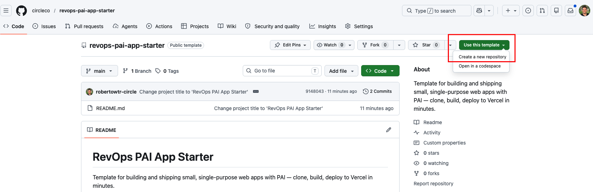
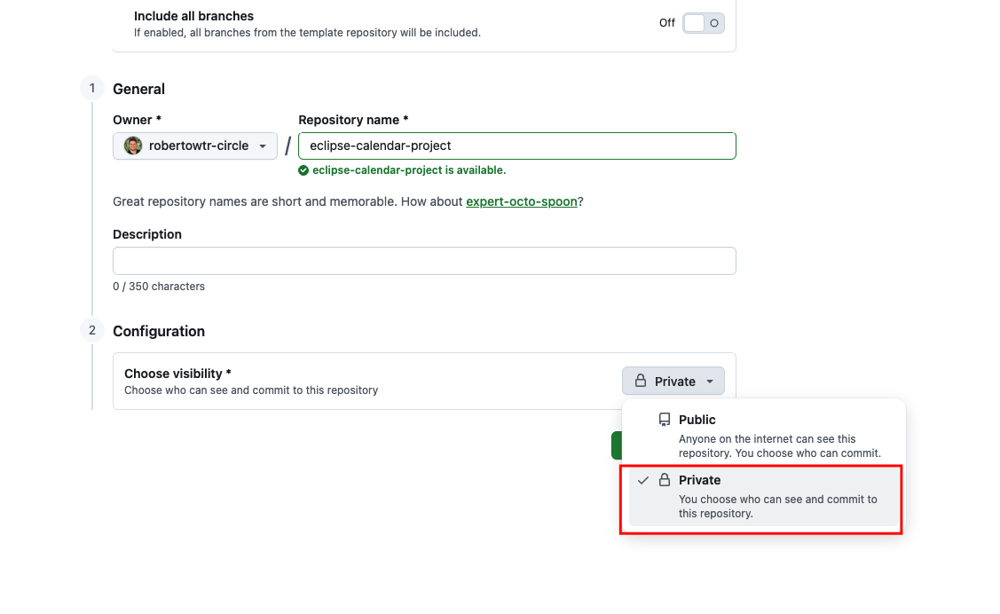
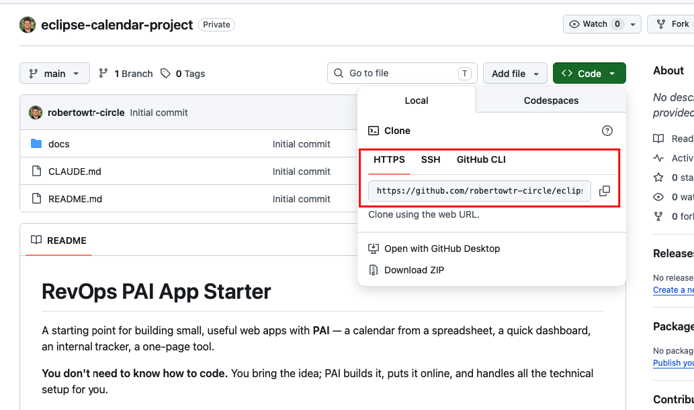
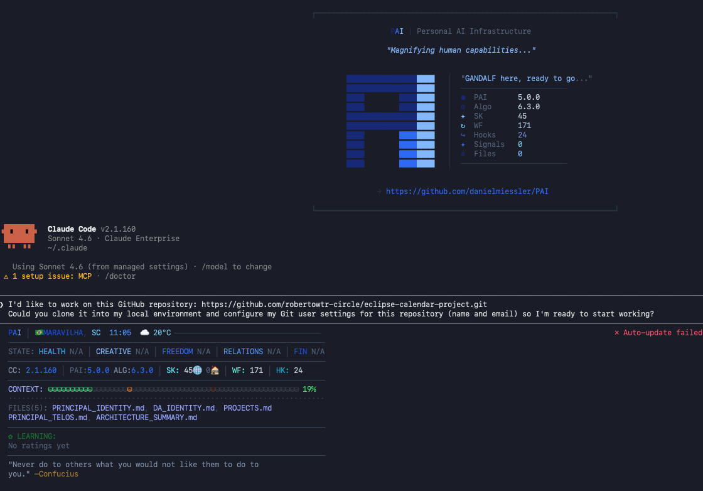

# RevOps PAI App Starter

A starting point for building small, useful web apps with **PAI** — a calendar from a spreadsheet, a quick dashboard, an internal tracker, a one-page tool.

**You don't need to know how to code.** You bring the idea; PAI builds it, puts it online, and handles all the technical setup for you.

## How to use it

### 1. Open the template

Go to 👉 **[github.com/circleco/revops-pai-app-starter](https://github.com/circleco/revops-pai-app-starter)**

### 2. Make your own copy

Click the green **"Use this template"** button → **Create a new repository**. Give it a name (like `my-campaign-calendar`).



⚠️ **Set the visibility to Private.** This is required — your app may read internal data, so the repository must never be public.



Then click **Create repository**. This gives you your own private copy — the original stays untouched.

### 3. Copy your repo's link

On your new repository, click the green **"Code"** button → on the **HTTPS** tab, copy the web URL (it looks like `https://github.com/<your-user>/your-app.git`).



### 4. Give PAI the link

Open PAI / Claude Code, then paste this message — swap in the link you copied in step 3:

```
I'd like to work on this GitHub repository: <Project URL>. Could you clone it into my
local environment and configure my Git user settings for this repository (name and email)
so I'm ready to start working?
```

PAI clones the repo to your computer and sets up your Git identity for it. Now PAI can see your project and you're ready to build.



### 5. Start building

Just say what you want, in plain words — for example:

> "Build me a calendar that reads this Google Sheet: <link>"

> "Make a dashboard that shows our weekly numbers."

PAI reads the built-in instructions in this template and takes care of the rest: writing the app, putting it online at a live link you can share, and the GitHub/Vercel plumbing behind the scenes. If it ever needs you to log in somewhere or make a choice, it'll ask.

That's it — **you bring the idea, PAI handles the technical part.**
